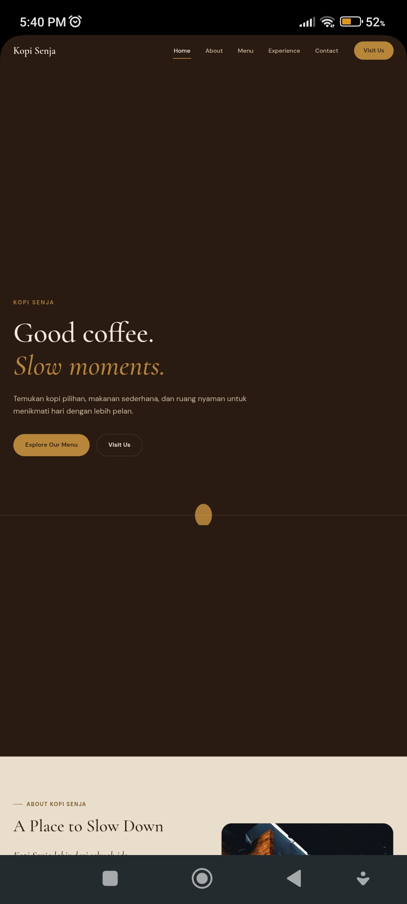
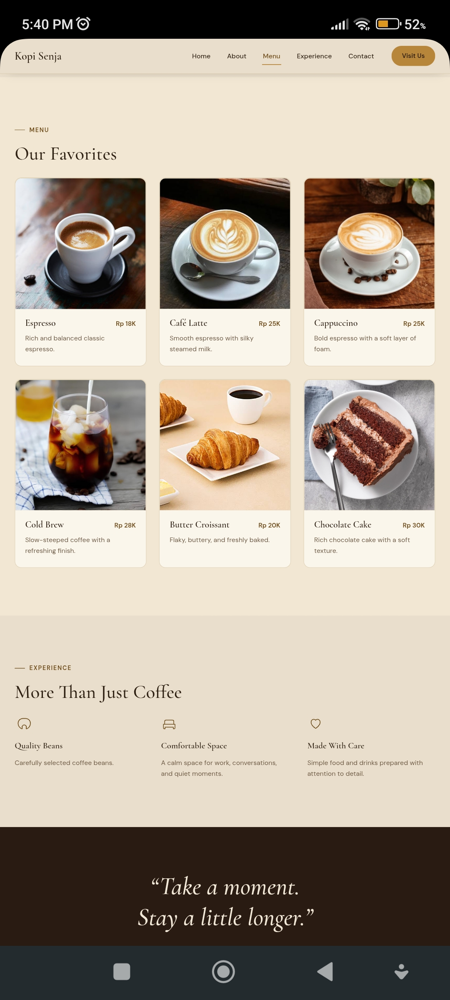

# Kopi Senja — Coffee Shop Landing Page

## Overview

**Kopi Senja** ("Dusk Coffee") is a fictional coffee shop landing page
built as a front-end development portfolio project. It's the second
project in my portfolio as a PPLG (Software and Game Development)
student, made to practice building a modern, responsive business
landing page with plain HTML, CSS, and JavaScript — no frameworks.

🔗 **Live Demo:** [Live Demo](https://glkrynwan.github.io/coffee-shop-landing-page/)

> This is a fictional brand created for educational and portfolio
> purposes — not a real business.

## Features

- Responsive design (mobile, tablet, laptop, desktop)
- Sticky/fixed navbar that starts transparent over the hero and
  becomes solid on scroll
- Mobile hamburger navigation
- Smooth scrolling between sections
- Scroll-reveal animations via `IntersectionObserver`
- Active navigation state tied to the section in view
- Semantic, accessible HTML structure
- Respects `prefers-reduced-motion`

## Technologies

- HTML5
- CSS3 (custom properties, Grid, Flexbox)
- Vanilla JavaScript (no frameworks or libraries)

## Project Structure

```
coffee-shop-landing-page/
├── index.html
├── style.css
├── script.js
├── assets/
│   ├── images/     # add your real product/interior photos here
│   └── icons/       # (unused — icons are inline SVG in index.html)
└── README.md
```

## Screenshots

_Add screenshots of the site here once deployed, e.g.:_

```


```

## How to Run Locally

No build tools or installation required.

1. Download or clone this repository.
2. Open `index.html` directly in your browser, **or** run a local
   server (recommended once you add real images):

   ```bash
   # Using Python
   python -m http.server 5500

   # Using VS Code
   # Install the "Live Server" extension, then right-click
   # index.html → "Open with Live Server"
   ```

3. Visit `http://localhost:5500`.

## What to Customize

- **Images** — every photo on the page is currently a styled
  placeholder box marked with an HTML comment
  (`<!-- Replace this image with your own coffee shop photo -->`).
  Drop your real photos into `assets/images/`, then swap the
  `.img-placeholder` `<div>` for an `` tag pointing to your file
  (remember to write a real, descriptive `alt` attribute).
- **Menu items** — in `index.html`, search for `Our Favorites` to find
  the six `.menu-card` items. Edit the name, description, and price
  (or duplicate a `<article class="menu-card">` block to add more).
- **Address & hours** — search for `Find Us` in `index.html` and edit
  the `<address>` block and the `.hours` rows.
- **Get Directions link** — replace the placeholder Google Maps search
  URL in the `Get Directions` button with your real location link.
- **Social & email** — search for `kopisenja` and
  `hello@kopisenja.example` in `index.html` (they appear in the
  Contact section and the footer) and replace them with your real
  Instagram handle and email address.
- **Brand name/colors** — the palette and type scale live in the
  `:root` variables at the top of `style.css`
  (`--color-background`, `--color-accent`, etc.), so you can re-theme
  the whole site from one place.

## How to Deploy to GitHub Pages

1. Create a new repository on GitHub (e.g. `coffee-shop-landing-page`).
2. Push this project to that repository:

   ```bash
   git init
   git add .
   git commit -m "Initial commit: Kopi Senja landing page"
   git branch -M main
   git remote add origin https://github.com/yourusername/coffee-shop-landing-page.git
   git push -u origin main
   ```

3. On GitHub, go to **Settings → Pages**.
4. Under **Source**, select the `main` branch and the `/ (root)`
   folder, then save.
5. GitHub will publish the site at:
   `https://yourusername.github.io/coffee-shop-landing-page/`
6. Update the "Live Demo" link at the top of this README once it's live.

## Future Improvements

- Add menu filtering (e.g. by category: coffee, food, cold drinks)
- Add a reservation/table-booking system
- Add a real backend for the contact section
- Improve accessibility further (more thorough screen reader testing)
- Add multilingual support (Bahasa Indonesia / English toggle)

## Disclaimer

This is a fictional brand created for educational and portfolio
purposes. Kopi Senja is not a real business, and any resemblance to
an existing coffee shop is coincidental.

## Author

**Muhammad Galil Kurniawan**
PPLG Student · Aspiring Software Developer
Indonesia 🇮🇩
